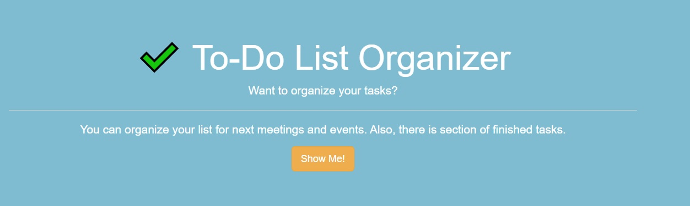
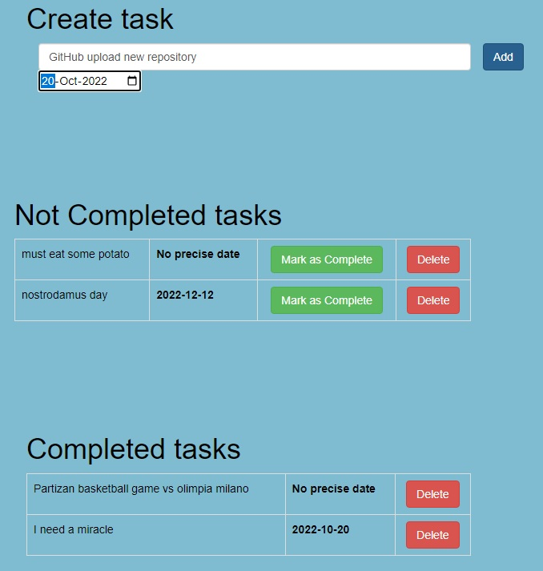

# To-Do List Website, Python

* Next project I've working on is TO-DO List. Put on practice some Flask Back-End with RESTfull routing, 
  Flask-Bootstrap quick styling Front-End, and create sqlite with Flask-Sqlalchemy to track my tasks.

* Website that gave me some inspiration:

  [TO-DO List Example](https://flask.io/new)

### Requirements

##### Flask Module:

[Flask docs](https://flask.palletsprojects.com/en/2.2.x/)

##### Jinja1 Template
[Jinja2 docs](https://jinja.palletsprojects.com/en/3.1.x/)

##### Flask-Bootstrap Module:

[Flask-Bootstrap docs](https://bootstrap-flask.readthedocs.io/en/stable/)

##### Flask-SQLalchemy Module:

[Flask-SQLalchemy docs](https://flask-sqlalchemy.palletsprojects.com/en/latest/)

##### HTML&CSS
[HTML & CSS](https://www.w3schools.com/)

### Usage

* When open the Web Page, there is pretty bootstrap styled home page. When click show me, it move us to info page,
  styled with some basic front-end where focus in this project is about RESTful routing and sqlite.
  

      
*   Below the header we have entry to add name of our task, pick up the date and click add to put information to 
  our database.
  
*   As we put some data, we show them in "not completed tasks" and there is table with nice organized data.
    Next to our data we have buttons "mark as complete" and "delete". Delete button delete data from database permanently,
    mark as complete move data below the header "Completed tasks" and that data under the header have option just to 
    permanently delete.

    
### Ideas for future improvements

##### This project as any other have always space for improvements.
    I use a lot ideas to practice and upgrade my skills.
    
* Improve User Interface, User Experience.
* more CSS and Bootstrap Styling.
* Add login and admin benefits to handle more options.
* Create user table in database to interact to-do list so we can save that list per user.
* Convert sqlite to postgres to host web site live on Heroku.
* Better organise of css and html code, style styles.css.
